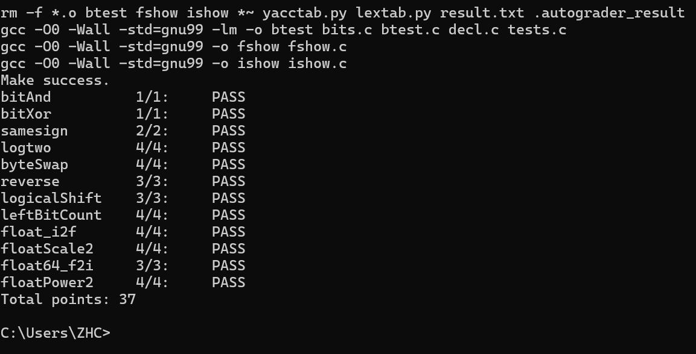

# datalab 报告

姓名：张祜铖

学号：2025200711

bitAnd          1/1:     PASS
bitXor          1/1:     PASS
samesign        2/2:     PASS
logtwo          4/4:     PASS
byteSwap        4/4:     PASS
reverse         3/3:     PASS
logicalShift    3/3:     PASS
leftBitCount    4/4:     PASS
float_i2f       4/4:     PASS
floatScale2     4/4:     PASS
float64_f2i     3/3:     PASS
floatPower2     4/4:     PASS
Total points: 37

test

## 解题报告

### 亮点

logtwo ,float_i2f
### bitAnd(int x, int y)
x&y=~(~x|~y)直接用德摩根定律
### bitXor(int x, int y)

排除全 0 和全 1 情况，既非全0也非全1则取1，否则取0
### samesign(int x, int y)
直接右移31位得到两个数符号位，处理 0；00 返回 1，0和非0返回 0；都非0 比较符号位是否相等
### byteSwap(int x, int n, int m)

取出两个字节并移位实现交换位置，再将原位置都转为0
### reverse(unsigned v)
   分治法，用掩码实现只取特定位数字
   依次次交换相邻16，8，4，2，1位

### logtwo

int logtwo(int v) {
    int res = 0;
    res = res | (((v >> 16) > 0) << 4);        
    res = res | (((v >> (res | 8)) > 0) << 3);    
    res = res | (((v >> (res | 4)) > 0) << 2);    
    res = res | (((v >> (res | 2)) > 0) << 1);    
    res = res | ((v >> (res | 1)) > 0);           
    return res;
}
用二分查找法查找最高位，用位运算模拟if case then x+=a的操作

### logicalShift(int x, int n)
return (x>>n)&~((1 << 31) >> n<<1) ;
先算术右移，构造掩码（高n位为0，其余为1）把预计应该为0的部分置0
###  float_i2f

unsigned float_i2f(int x) {
   if (x == 0) return 0;
    if (x == 0x80000000) return 0xCF000000;
    unsigned sign = x & 0x80000000;
    unsigned exp = 0;
    unsigned cur;
    if (x < 0) {
        cur = ~x + 1;
    } else {
        cur = x;
    }
    unsigned temp = cur;
    while (temp > 1) {
        temp = temp >> 1;
        exp++;
    }
    unsigned raw = cur << (31 - exp);
    unsigned frac = (raw >> 8) & 0x007FFFFF;
    unsigned last_8 = raw & 0xFF;
    if ((last_8 > 0x80)|((last_8 == 0x80) & (frac & 1))) {
        frac += 1;
        if (frac >> 23) {
            frac = 0;
            exp++;
        }
    }
    unsigned E = (exp + 127) << 23;
    return sign | E | frac;
}
分4步，先取符号位sign，
然后取绝对值，先找最高位1（得到指数部分）处理E，
取24位有效数字（实际屏蔽最高位1，1.xxxxx不用存1，得frac .xxxxx），
用后8位判断舍入逻辑，如果进位导致最高位进位，指数加1
### floatScale2(unsigned uf)

NaN/Inf 直接返回原值；非规格化尾数直接左移 1位，出现进位直接溢出到阶码位，阶码加1且0.xxx转为1.xxx（1实际溢出到阶码位，相当与阶码加1），规格化阶码直接+1即可

### float64_f2i(unsigned uf1, unsigned uf2)

double 转 int；E<1023 返回 0；exp>=31 溢出返回 0x80000000；处理符号位，再根据指数直接移位拼接有效数字
### floatPower2(int x)
unsigned floatPower2(int x) {
    if (x > 127) {
        return 0x7F800000; 
    }
    if (x < -149) {
        return 0;
    }
    if (x >= -126) {
        unsigned exp = x + 127;
        return exp << 23;
    } else{
        int k = -126 - x;
        return 1 << (23 - k);
    }
}
2为底数，规格化下相当于尾数固定，直接拼接阶码，非规格化移位确定具体尾数x>127 返回正无穷；x<-149 返回 0；[-126,127] 规格化置阶码；过小走非规格化尾数移位
### ......

## 反馈/收获/感悟/总结
log2最开始没考虑全1的边界条件导致出错
最开始i2f函数没有按银行家规则舍入，误以为四舍五入，后面求助ai才发现距离恰好相等时要舍入到偶数（但是课件好像没提）
在int移位操作中没有注意1移到32位后再右移会导致高位出现全1（期待为全0），要注意int默认算数右移而非unsigned的逻辑右移

## 参考的重要资料
课件
